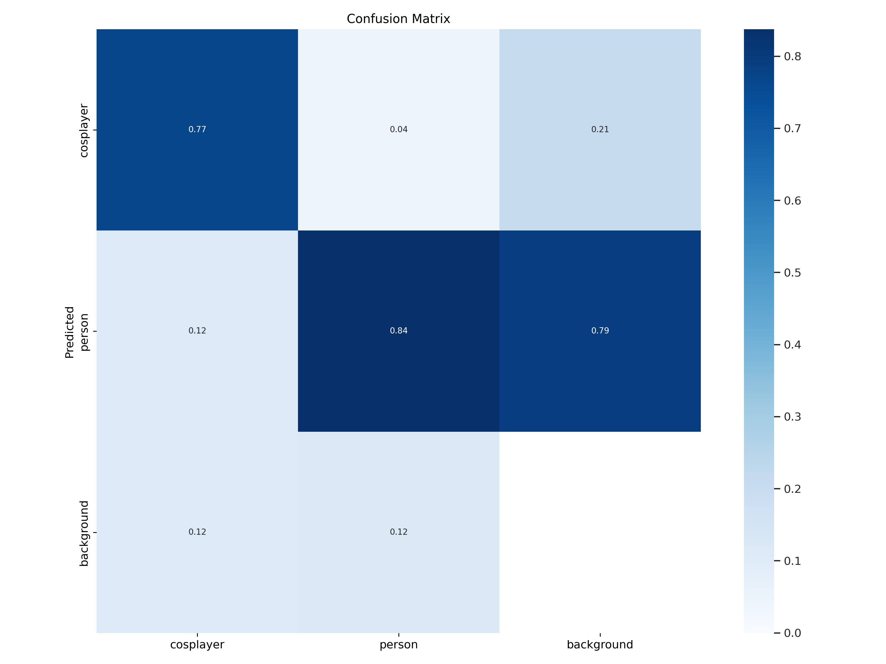
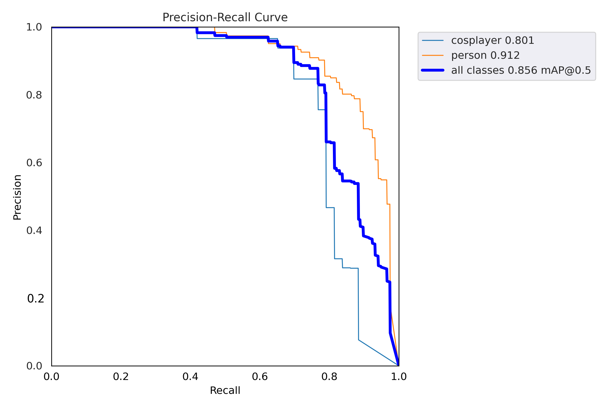
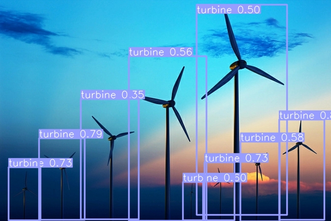
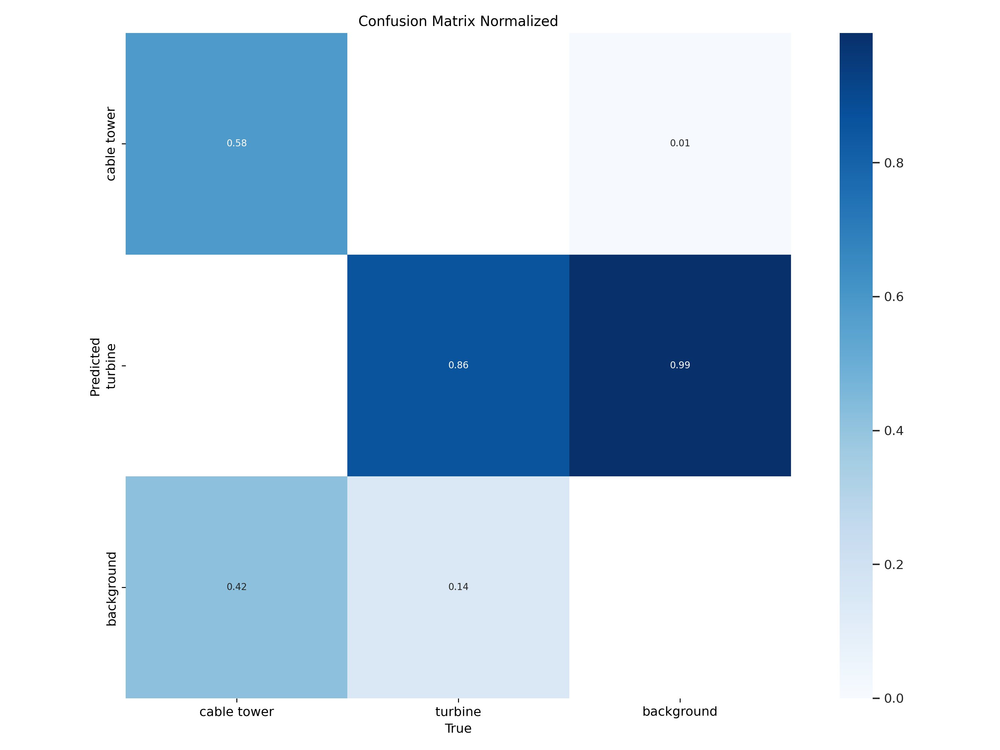

# FRCNN project

## Описание проекта

Этот проект представляет собой набор моделей машинного обучения для обнаружения и классификации объектов на изображениях. Ниже приведено описание каждой модели и ключевых особенностей.

### Модель Cosplay (бонус)

- Эта модель обучена для обнаружения косплееров на изображениях.
- Модель использует архитектуру YOLO9 для обнаружения косплееров.
- Для обучения модели использовался датасет из 200 изображений косплееров, который был аугментирован до 600 изображений.
- Модель обучалась в течение 25 эпох.

### Модель с ветряками и столбами

- Модель использует архитектуру YOLOv8 для обнаружения ветряков и электрических столбов на изображениях.
- Для обучения модели использовался датасет из 2885 изображений с ветряками и электрическими столбами.
- Модель обучалась в течение 8 эпох.

.png)
.png)

### Модель на основе ResNet-18 для классификации и локализации овощей

- Модель использует архитектуру ResNet-18 для классификации и локализации объектов на изображениях.
- Для обучения модели использовался датасет из 118 изображений, содержащих огурцы, баклажаны и грибы.
- Модель обучалась в течение 10 эпох.

