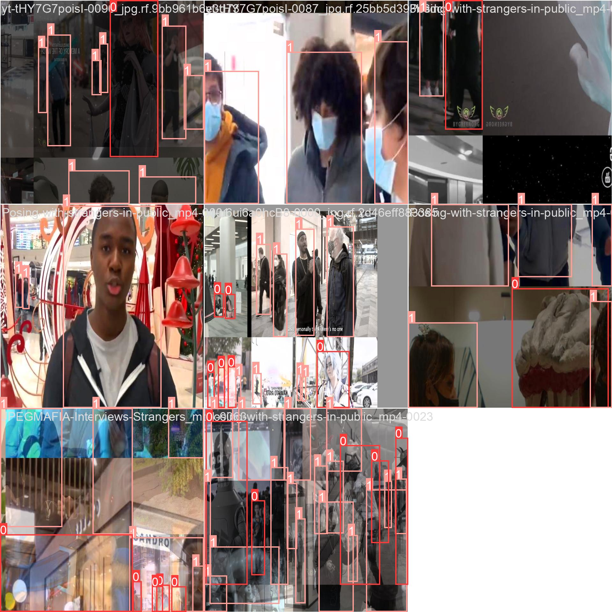
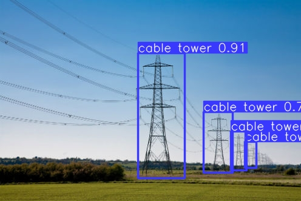

# FasterRCNN
Для создания README файла для вашего проекта, который включает описание каждой модели и их метрики, вы можете использовать следующий шаблон:

```markdown
# FRCNN проект

## Описание

Этот проект представляет собой систему компьютерного зрения, разработанную для обнаружения и классификации различных объектов на изображениях. Ниже приведено описание каждой модели и ее особенностей.

### модель обнаружения косплееров

Модель обучена для обнаружения косплееров на изображениях с использованием архитектуры YOLO9. Для обучения использовался датасет из 600 изображений косплееров. Модель обучалась в течение 25 эпох.

Примеры изображений с обнаруженными косплеерами:

 

  

Метрики модели:

- Матрица ошибок (Confusion Matrix):
  

- График Precision-Recall:
  

- График F1-Score:
  

- График R-Curve:
  

- График P-Curve:
  

- График результатов:
  

- Таблица гиперпараметров (Hyp.yaml):
  ```yaml
  # Содержание файла Hyp.yaml
  ```

- Таблица оптимизаций (Opt.yaml):
  ```yaml
  # Содержание файла Opt.yaml
  ```

### Модель с ветряками и столбами

Модель использует архитектуру YOLOv8 для обнаружения ветряков и электрических столбов на изображениях. Для обучения использовался датасет из 2885 изображений. Модель обучалась в течение 8 эпох.

Примеры изображений с обнаруженными ветряками и столбами:

 

Метрики модели:

- Матрица ошибок (Confusion Matrix):
  

- График Precision-Recall:
  .png)

- График результатов:
  .png)

### Модель для классификации и локализации объектов

Модель на основе ResNet-18 была разработана для классификации и локализации объектов на изображениях. Для обучения использовался датасет из 118 изображений. Модель обучалась в течение 10 эпох.

Примеры изображений:

  

Ключевые особенности:

- Использование модели ResNet-18 для классификации и локализации объектов.
- Обучение модели на небольшом датасете в течение 10 эпох.
- Применение замороженных слоев извлекателя признаков и отдельных блоков для классификации и предсказания координат.

```

Этот README файл содержит описание каждой модели, примеры изображений и их метрики. Пожалуйста, замените `images/exp4/` и `images/yolo results/` на пути к вашим изображениям.